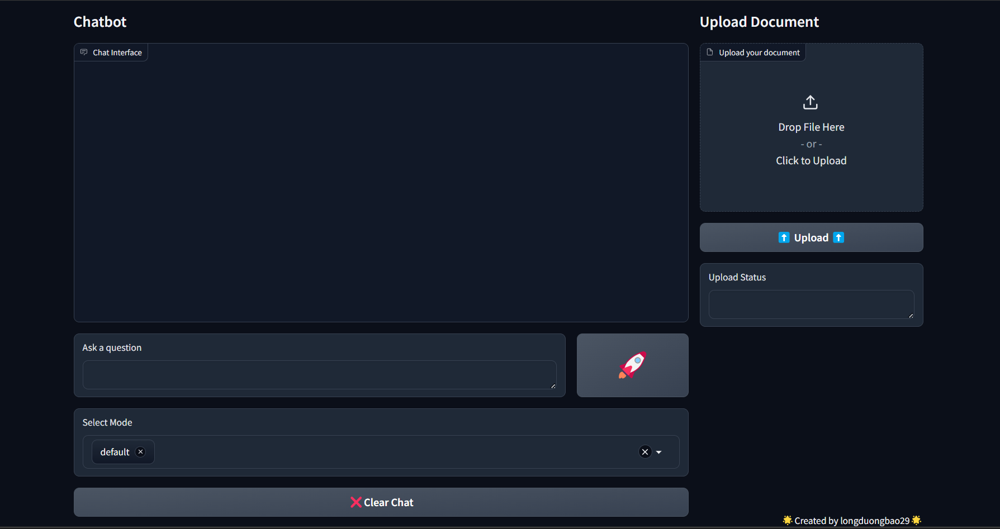

# RAG with Llama and Qdrant
This project implements a Retrieval-Augmented Generation (RAG) system using Llama and Qdrant for document retrieval, enabling seamless interaction with both local and online data sources. The system supports various modes of retrieval and query decomposition, designed for enhanced answer generation.

Document: [Document for RAG](https://docs.google.com/document/d/1lgn-TPh1z7PJFqav3PLtPor41kR_RiRNgMRnrnnVnvg/edit)
## Table of Contents

- [Installation](#installation)
- [Usage](#usage)
- [Contributing](#contributing)
- [Contact](#contact)

## Installation

Provide step-by-step instructions on how to install and set up your project. For example:

1. Clone the repository:
    ```sh
    git clone https://github.com/longduongbao29/RAG_llama_qdrant
    ```
2. Navigate to the project directory:
    ```sh
    cd RAG_llama_qdrant
    ```
3. Install dependencies:
    ```sh
    pip install -r requirements.txt
    ```
4. Set up environment variables:
    Create .env file and configure environment variables. Example:
   ```sh
    QDRANT_ULR = https:://qdrant/abc
    QDRANT_API_KEY = key29012003
    TAVILY_API_KEY = tvly-1234
    GROQ_API_KEY = gsk_abc123
   ```
6. Run API:
    ```sh
    python3 main.py
    ```
7. Run application with UI:
    ```sh
    python3 -m uvicorn rag_ui:ui_app --host 0.0.0.0 --port 1234
    ```
    Access in brower: https://localhost:1234
## Usage

### Use API for retriever document

Using the API for Document Retrieval
Once the server is running, you can use the following API endpoints to interact with the system:

API Endpoints
#### Root Endpoint:

Description: Basic welcome message and a link to the API documentation.
Method: GET
Endpoint: /
Response: HTML content with a welcome message and a link to /docs.
#### Document Retriever:

Description: Retrieve relevant documents based on the question and retrieval mode.
Method: POST
Endpoint: /retriever
Payload:
question (str): The question to retrieve relevant documents for.
mode (str): The retrieval mode (e.g., "default", "multi-query", "rag-fusion", "recursive-decomposition", "step-back", "hyde").
Response: List of relevant documents.
#### Ask a Question:

Description: Use an agent that integrates a search tool and retriever tool to answer a question based on the given retrieval mode.
Method: POST
Endpoint: /ask
Payload:
question (str): The question to answer.
retrieval_schema (str): The retrieval mode.
history (list): The conversation history to use in context.
Response: Generated answer based on the retrieved documents and query processing.
#### Upload File to Database:

Description: Upload a document to be processed, vectorized, and stored in the Qdrant vector database.
Method: POST
Endpoint: /upload
Payload:
file (UploadFile): The file to be uploaded (e.g., .txt, .pdf).
Response: Success message and the topic of the document.
Example Usage
To ask a question using the /ask endpoint:

```sh
curl -X POST "http://localhost:8000/ask" \
-H "Content-Type: application/json" \
-d '{
  "question": {
    "question": "What is the capital of France?"
  },
  "retrieval_schema": {
    "mode": ["default"]
  },
  "history": []
}'
```
or you can using via FastAPI docs: http://localhost:8000/docs

### Using the System via the UI: 
```sh
    python3 -m uvicorn rag_ui:ui_app --host 0.0.0.0 --port 1234
```
Access in brower: https://localhost:1234

## Contributing
Fork the repository.
Create a new branch: git checkout -b feature-branch.
Make your changes and commit them: git commit -m 'Add feature'.
Push to the branch: git push origin feature-branch.
Submit a pull request.
License
This project is licensed under the MIT License. See the LICENSE file for more details.

## Contact
Author: Duong Bao Long
Email: longduongbao@gmail.com
Feel free to reach out if you have any questions or need further assistance!
